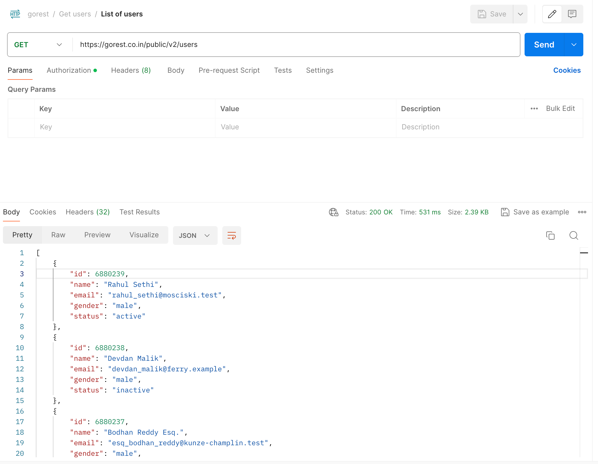
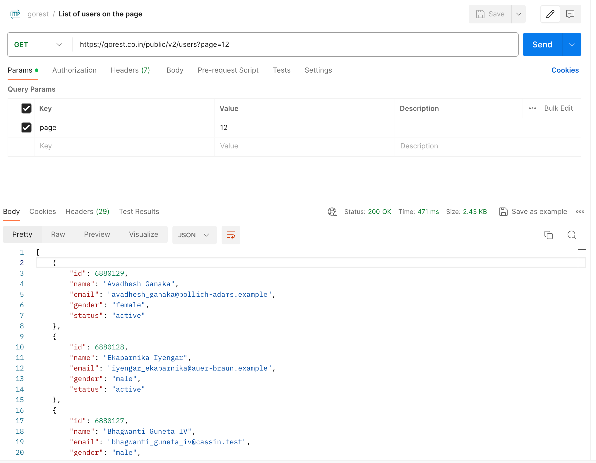
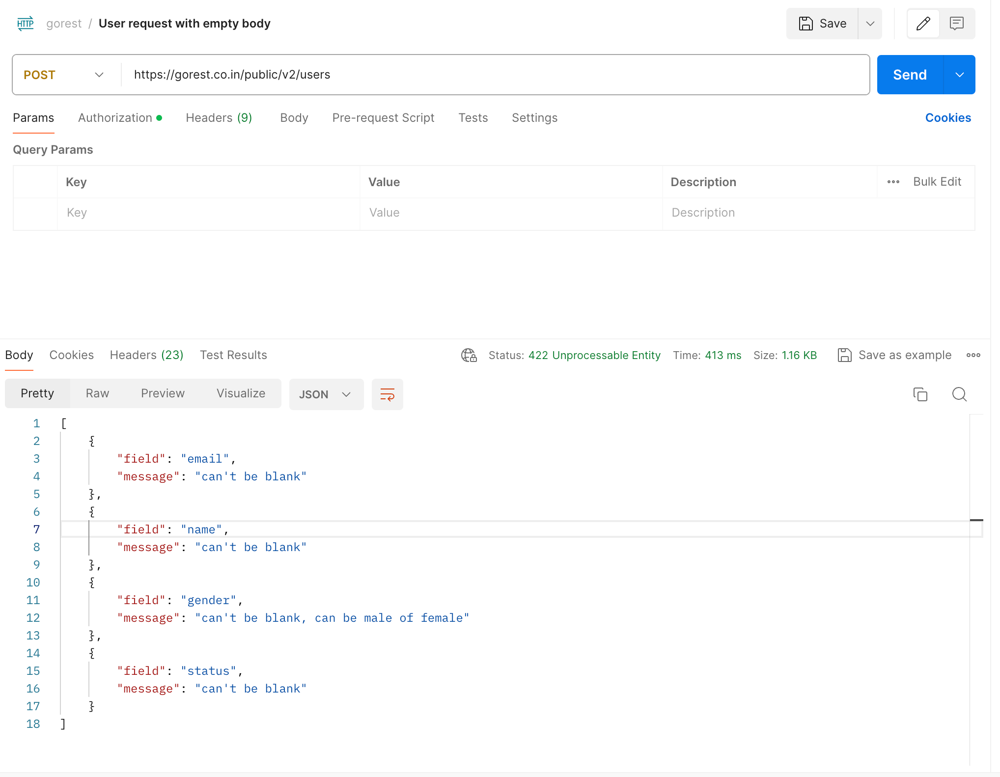
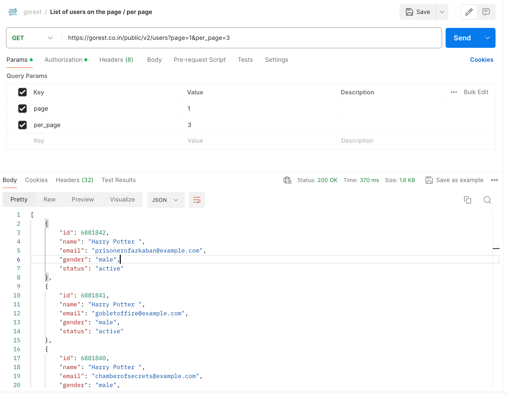
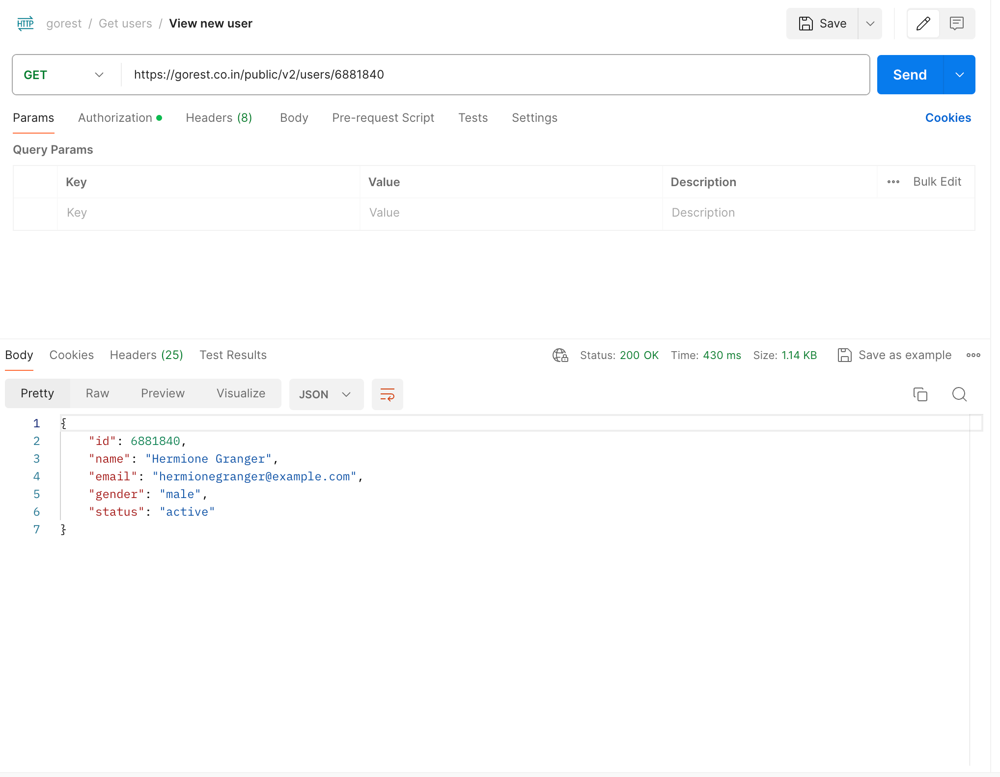
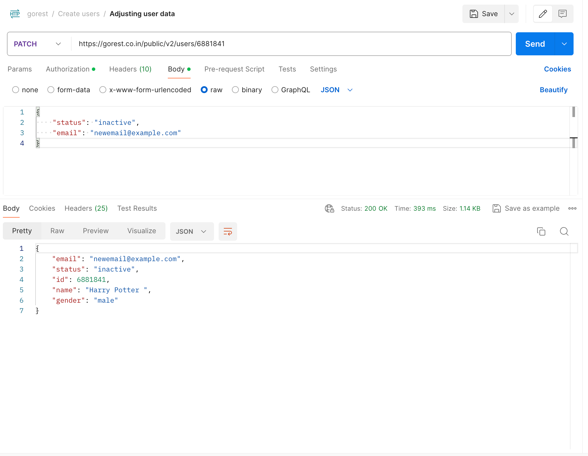
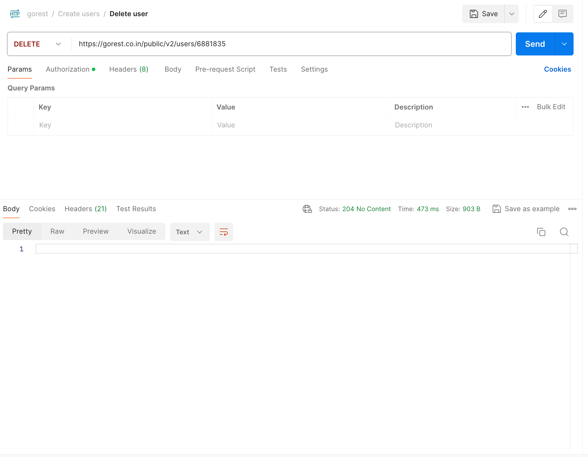
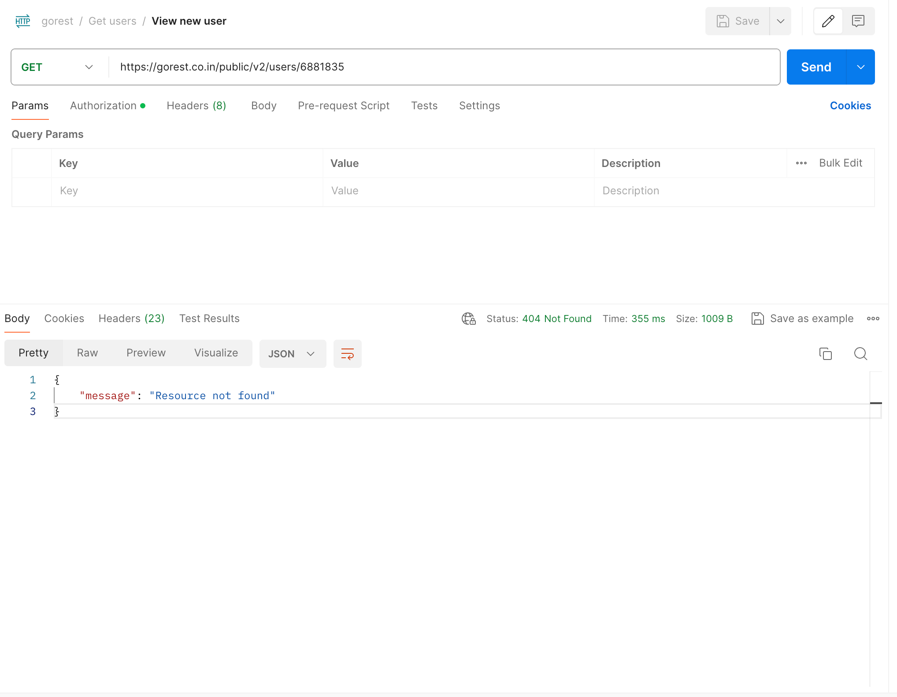
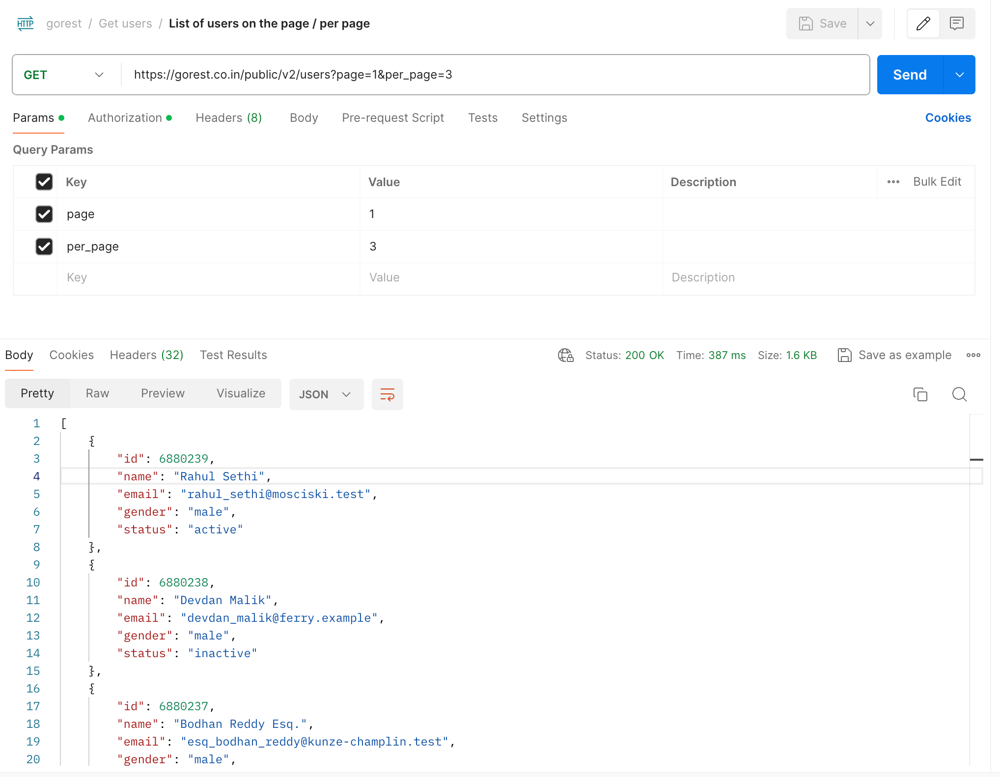

= Results
:sectnums:
:toc: left
:toclevels: 5
:icons: font
:source-highlighter: coderay

== Получите список пользователей.

=== Каким запросом получили список пользователей?

`GET https://gorest.co.in/public/v2/users`

=== Какой статус ответа получили?

Статус ответа - 200 (ОК)

=== Что содержится в теле ответа?

В теле ответа - json-объект, представляющий список пользователей

[source,json]
----
[
    {
        "id": 6880239,
        "name": "Rahul Sethi",
        "email": "rahul_sethi@mosciski.test",
        "gender": "male",
        "status": "active"
    },
    {
        "id": 6880238,
        "name": "Devdan Malik",
        "email": "devdan_malik@ferry.example",
        "gender": "male",
        "status": "inactive"
    },
    {
        "id": 6880237,
        "name": "Bodhan Reddy Esq.",
        "email": "esq_bodhan_reddy@kunze-champlin.test",
        "gender": "male",
        "status": "inactive"
    },
    {
        "id": 6880236,
        "name": "Pres. Abhaya Sinha",
        "email": "pres_sinha_abhaya@kovacek.test",
        "gender": "male",
        "status": "inactive"
    },
    {
        "id": 6880235,
        "name": "Vaishno Nehru",
        "email": "vaishno_nehru@smith-morissette.test",
        "gender": "female",
        "status": "active"
    },
    {
        "id": 6880234,
        "name": "Preity Abbott",
        "email": "preity_abbott@littel-harvey.test",
        "gender": "female",
        "status": "active"
    },
    {
        "id": 6880233,
        "name": "Ambar Guneta IV",
        "email": "ambar_guneta_iv@wintheiser-abbott.example",
        "gender": "male",
        "status": "active"
    },
    {
        "id": 6880232,
        "name": "Amrit Malik",
        "email": "malik_amrit@grimes-kuvalis.test",
        "gender": "male",
        "status": "inactive"
    },
    {
        "id": 6880231,
        "name": "Ambar Sharma",
        "email": "sharma_ambar@hintz.test",
        "gender": "male",
        "status": "inactive"
    },
    {
        "id": 6880230,
        "name": "Shreya Sethi",
        "email": "sethi_shreya@hills.example",
        "gender": "male",
        "status": "active"
    }
]
----

=== Сделайте скриншот.

== Модифицируйте запрос и получите страницу 12.

`GET https://gorest.co.in/public/v2/users?page=12`

=== Что содержится в теле ответа?

Статус ответа - 200, в теле ответа - json-объект, представляющий список пользователей на 12 странице.

[source,json]
----
[
    {
        "id": 6880129,
        "name": "Avadhesh Ganaka",
        "email": "avadhesh_ganaka@pollich-adams.example",
        "gender": "female",
        "status": "active"
    },
    {
        "id": 6880128,
        "name": "Ekaparnika Iyengar",
        "email": "iyengar_ekaparnika@auer-braun.example",
        "gender": "male",
        "status": "active"
    },
    {
        "id": 6880127,
        "name": "Bhagwanti Guneta IV",
        "email": "bhagwanti_guneta_iv@cassin.test",
        "gender": "male",
        "status": "active"
    },
    {
        "id": 6880126,
        "name": "Miss Saroja Sharma",
        "email": "sharma_saroja_miss@schroeder-kertzmann.test",
        "gender": "female",
        "status": "inactive"
    },
    {
        "id": 6880125,
        "name": "Karunanidhi Jain",
        "email": "jain_karunanidhi@altenwerth.test",
        "gender": "female",
        "status": "inactive"
    },
    {
        "id": 6880124,
        "name": "The Hon. Divya Kakkar",
        "email": "the_kakkar_divya_hon@abbott.example",
        "gender": "female",
        "status": "inactive"
    },
    {
        "id": 6880123,
        "name": "Datta Desai",
        "email": "datta_desai@koch.example",
        "gender": "female",
        "status": "active"
    },
    {
        "id": 6880122,
        "name": "Gandharva Johar",
        "email": "gandharva_johar@mills.example",
        "gender": "female",
        "status": "active"
    },
    {
        "id": 6880121,
        "name": "Mr. Shashi Mishra",
        "email": "shashi_mr_mishra@schamberger.test",
        "gender": "male",
        "status": "inactive"
    },
    {
        "id": 6880120,
        "name": "Nikita Bharadwaj DO",
        "email": "bharadwaj_nikita_do@rath.test",
        "gender": "male",
        "status": "active"
    }
]
----

=== Сделайте скриншот.

== Какие отличия запроса в п.2 от запроса в п.1?

Единственное отличие между запросами в пункте 1 и пункте 2 - это наличие реквест параметра page во втором запросе, который указывает на нужную страницу списка пользователей.

== Сделайте post запрос для получения пользователя с пустым телом запроса.

`POST https://gorest.co.in/public/v2/users`

=== Какой ответ пришел и почему?

POST-запросы обычно используются для создания новых ресурсов или выполнения каких-то действий на сервере.
В нашем случае, при выполнении данного запроса вернулся статус 422. В боди ответа вернулись рекомендации по заполнению полей (валидаторы):

* Поле email не может быть пустым.
* Поле name не может быть пустым.
* Поле gender не может быть пустым и должно быть указано значение "male" или "female".
* Поле status не может быть пустым.

[source,json]
----
[
    {
        "field": "email",
        "message": "can't be blank"
    },
    {
        "field": "name",
        "message": "can't be blank"
    },
    {
        "field": "gender",
        "message": "can't be blank, can be male of female"
    },
    {
        "field": "status",
        "message": "can't be blank"
    }
]
----

=== Сделайте скриншот.

== Напишите запрос для создания пользователя, используя метод raw => json.

`POST https://gorest.co.in/public/v2/users`

[source,json]
----
{
    "name": "Harry Potter ",
    "email": "harrypotter@example.com",
    "gender": "male",
    "status": "active"
}
----

=== Какой ответ пришел?

Статус ответа 201 - "Created".
Это означает, что запрос на создание пользователя был успешно выполнен.
В респонс боди вернулся параметр id, который можно использовать для дальнейших запросов.

[source,json]
----
{
    "id": 6881835,
    "name": "Harry Potter ",
    "email": "harrypotter@example.com",
    "gender": "male",
    "status": "active"
}
----

=== Сделайте скриншот.

== Напишите запрос, возвращающий в ответе запись о созданном пользователе.

`GET https://gorest.co.in/public/v2/users/6881835`

=== Сделайте скриншот.

== Создайте еще несколько пользователей с одинаковыми значениями “name”, но разными email.

=== Получите список всех только что созданных пользователей.

GET https://gorest.co.in/public/v2/users?page=1&per_page=3

Так как в рамках данной задачи было создано только 3 пользователя, значение per_page было проставлено - 3.

[source,json]
----
[
    {
        "id": 6881842,
        "name": "Harry Potter ",
        "email": "prisonerofazkaban@example.com",
        "gender": "male",
        "status": "active"
    },
    {
        "id": 6881841,
        "name": "Harry Potter ",
        "email": "gobletoffire@example.com",
        "gender": "male",
        "status": "active"
    },
    {
        "id": 6881840,
        "name": "Harry Potter ",
        "email": "chamberofsecrets@example.com",
        "gender": "male",
        "status": "active"
    }
]
----

=== Сделайте скриншот.

=== Какими ещё get запросами можно получить запись о пользователе?

Помимо поиска по id пользователя, можно настроить поиск:

* по адресу электронной почты `GET https://gorest.co.in/public/v2/users?email=chamberofsecrets@example.com`
* по имени пользователя `GET https://gorest.co.in/public/v2/users?name=Harry Potter `
* по статусу пользователя (у нас это "active" и "inactive" ) `GET https://gorest.co.in/public/v2/users?status=active`
* по полу ("male", "female") `GET https://gorest.co.in/public/v2/users?gender=male`

== Напишите запрос с методом put на изменение email и name на другое значение.

`PUT https://gorest.co.in/public/v2/users/6881840`

[source,json]
----
{
    "name": "Hermione Granger",
    "email": "hermionegranger@example.com"
}
----

=== Проверьте изменение get запросом.

`GET https://gorest.co.in/public/v2/users/6881840`

[source,json]
----
{
    "id": 6881840,
    "name": "Hermione Granger",
    "email": "hermionegranger@example.com",
    "gender": "male",
    "status": "active"
}
----

=== Сделайте скриншот.

== Чем отличаются запросы put и patch?

Метод put изменяет полностью имеющийся ресурс, методом patch можно частично изменить данные в имеющемся ресурсе.

=== Напишите запрос с методом patch для корректировки полей status и email.

`PATCH https://gorest.co.in/public/v2/users/6881841`

[source,json]
----
{
    "status": "inactive",
    "email": "newemail@example.com"
}
----

=== Сделайте скриншот.

=== В чем отличие полученного результата, от результата запроса из п.8?

TODO

== Удалите пользователя, созданного в п.5.

`DELETE https://gorest.co.in/public/v2/users/6881835`

=== Что содержится в теле ответа?

В теле ответа содержится код 204, который указывает на успешное выполнение операции удаления (No Content).

=== Сделайте скриншот.

=== Выполните get запрос удаленного пользователя.

`GET https://gorest.co.in/public/v2/users/6881835`

=== Какой ответ пришел и почему?

[source,json]
----
{
    "message": "Resource not found"
}
----

Код 404 - запись не найдена, так как мы ее удалили.

=== Сделайте скриншот.

== Удалите всех ранее созданных пользователей.

=== Проверяем методом GET и вставляем скриншот.

`GET https://gorest.co.in/public/v2/users?page=1&per_page=3`

[source,json]
----
[
    {
        "id": 6880239,
        "name": "Rahul Sethi",
        "email": "rahul_sethi@mosciski.test",
        "gender": "male",
        "status": "active"
    },
    {
        "id": 6880238,
        "name": "Devdan Malik",
        "email": "devdan_malik@ferry.example",
        "gender": "male",
        "status": "inactive"
    },
    {
        "id": 6880237,
        "name": "Bodhan Reddy Esq.",
        "email": "esq_bodhan_reddy@kunze-champlin.test",
        "gender": "male",
        "status": "inactive"
    }
]
----

== Сохраните коллекцию получившихся запросов в Postman.

link:./gorest.postman_collection.json[Postman collection]